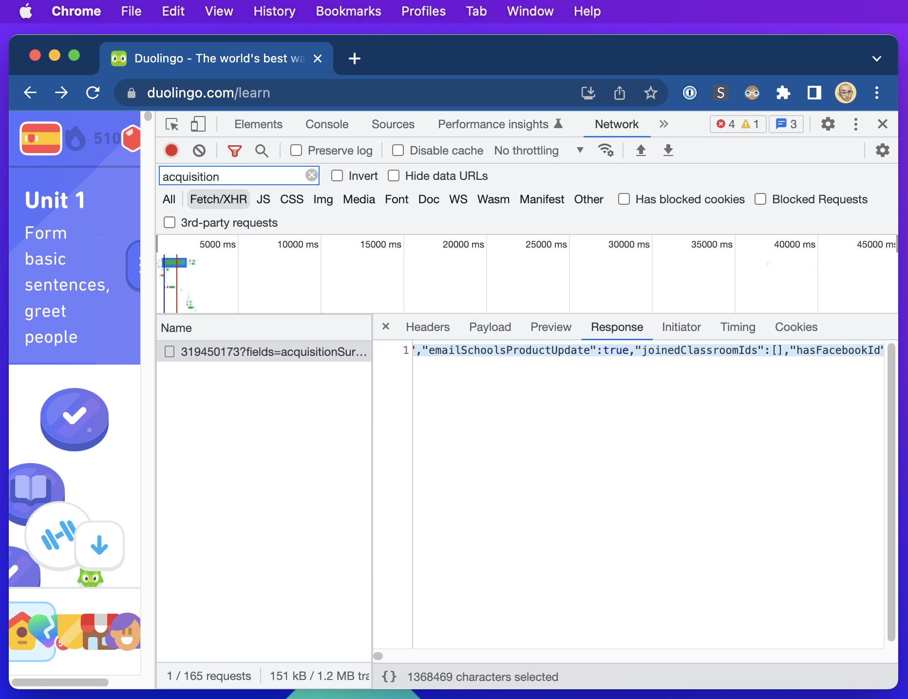
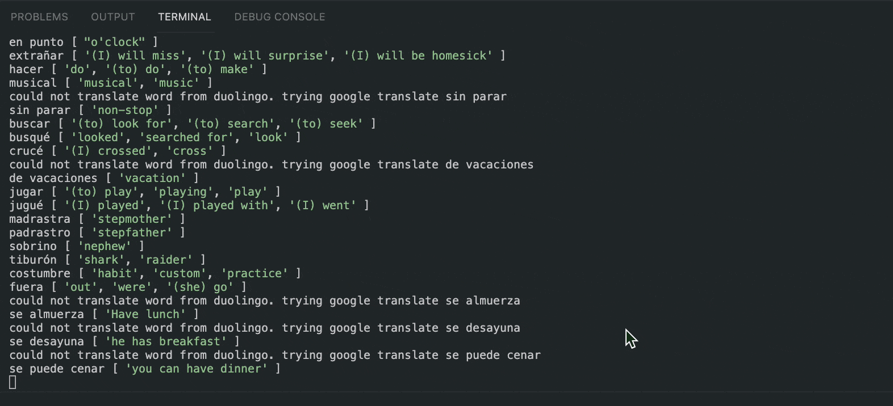

# Duolingo Vocab Lists  [](https://www.buymeacoffee.com/jmbeach)

This repository is a collection of Duolingo courses' vocabs.

Currently, the only course is Spanish (learned from English) in the "english-spanish" folder.

The list of words for a course can be downloaded in JSON and CSV format.

The main purpose of this project is to provide a means of getting the vocab in a format that is easy to import into a memorization tool. Tinycards does not seem to be maintained that well anymore (sadface).

# Parsing other courses

Originially, I wrote this program to parse the words in the Spanish course from [an awesome post in a Duolingo discussion](https://forum.duolingo.com/comment/41639645). Thank you so much [FieryCat](https://www.duolingo.com/profile/FieryCat)!

However, now the program parses words from the website [duome](https://duome.eu/Jared5788/progress) which has a very comprehensive list of the words for each course. Switched to this approach based on the [detailed blog post](https://melledijkstra.github.io/science/extracting-duolingo-vocabulary-to-quizlet) by [Melle Dijkstra](https://melledijkstra.github.io/).

To use the provided code:

## Step 1: Clone it.

Run `git clone git@github.com:jmbeach/duolingo-vocab-lists.git`

## Step 2: Install Dependencies / Build

Run `yarn install`.

Run `yarn build`.

## Step 3: Get Course Data

Login to [Duolingo.com](https://www.duolingo.com/learn). Open the network tab and look for a request that has the word **acquisition** in it. Open the Response tab and copy all of the text. Save the text to a file locally (like `english-spanish/raw-course-data.json`).

Note: This file may have sensitive data in it. Be sure to delete anything sensitive before committing it to your repo.



## Step 4: Get Vocab HTML

Go to `https://duome.eu/<your-user-name>/progress`. The skills tab contains an in-order list of all of the skills in your language. In the chrome developer console, run `document.querySelectorAll('.click.skill')` to expand every item on the page.

Once you've ran the querySelectorAll command, save the page to an HTML file. **NOTE**: you may have to clean the html file to ensure there is only one root note. For example: only Body as root.

## Step 5: Download Translations

Run `node lib/index.js download -f <path-to-vocab-html-file> -s  <path-to-course-data-json> [-a <google-api-key>]` to download the translations to a JSON file.

The translator defaults to finding transaltions of words on Duolingo.com. However, if it can't find one, it uses Google Translate. To use google translate you'll have to get an API key and then put your API key into a .env file like this:

```
GOOGLE_TRANSLATE_API_KEY=<my-api-key>
```

**NOTE**: Make sure to change your desired language pair inside `TranslationDownloader` (it's `es`, `en` by default).



## Step 6: Generate CSV Files

Finally, run `node lib/index.js create -f <path-to-json-file>` to turn the translations into CSV's.

If the new CSV's aren't in this repository yet, please feel free to create a pull request to add them. Currently, I've only processed Spanish (for English speakers), but would love to get other languages in here.

## Step 7 (Optional): Create Combined CSV Files

It might be preferable for some people to have all of the CSV files for each section combined into one file. To generate these, run `node lib/index.js combine -p <path to language directory>`.
